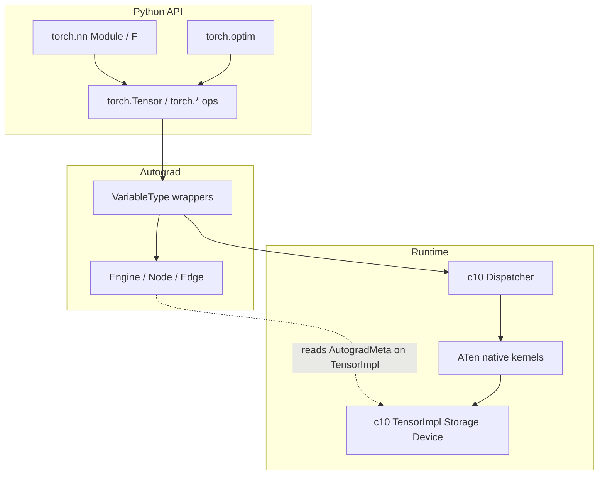
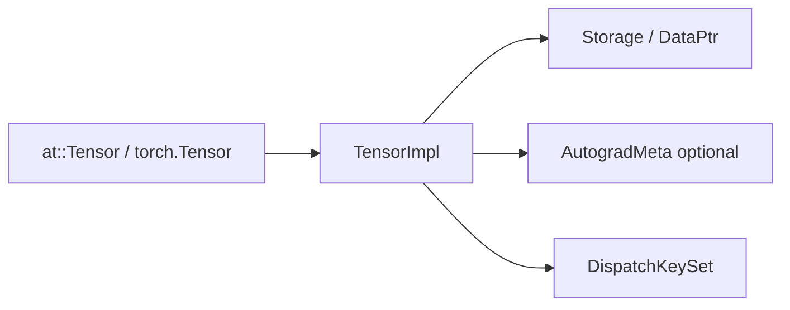

# 00 — Stack and Mental Model

## One-paragraph story

A training step is a thin Python loop over a deep C++ stack. `nn.Module` holds
parameters and calls into `nn.functional`, which calls ATen ops. Each op goes
through the **dispatcher**, which usually hits an **Autograd wrapper** first.
That wrapper redispatches to a numeric **ATen/backend kernel**, then stitches
outputs into a DAG of **Nodes** linked by **Edges**. `loss.backward()` runs the
**Engine**, which walks the DAG and writes leaf `.grad`. `Optimizer.step()`
reads those grads and updates parameter storage. Everything below that story
lives in `c10` (tensor body, storage, devices, dispatch keys).

## Layered dependency map



Larger standalone version: [diagrams/dependency-map.md](diagrams/dependency-map.md).

## What each layer owns

| Layer | Owns | Does **not** own |
|-------|------|------------------|
| `torch.nn` | Module tree, Parameters/Buffers, hooks, `state_dict` | Numerics (delegates to `F.*` / ATen) |
| `torch.optim` | Hyperparams, per-param state, `step`/`zero_grad` | Grad computation |
| `torch.autograd` (Python) | Public `backward`/`grad`/`Function`/`no_grad` | Heavy graph execution (C++) |
| `torch/csrc/autograd` | Nodes, Engine, AutogradMeta, codegen wrappers | Backend math kernels |
| Dispatcher | Which kernel runs for a schema + keyset | What the kernel computes |
| ATen native | Operator schemas + implementations | Module bookkeeping |
| c10 | TensorImpl, Storage, ScalarType, Device, DispatchKey | Ops |

## Data that flows



- **Payload:** bytes in `Storage` (via `DataPtr` + allocator).
- **View metadata:** sizes, strides, storage offset on `TensorImpl`.
- **Where to run:** `DispatchKeySet` on `TensorImpl` (+ TLS include/exclude).
- **How to differentiate:** lazy `AutogradMeta` (`grad_fn`, `grad_`, …).

See [02-c10-tensor-and-storage.md](02-c10-tensor-and-storage.md).

## Execution flow of one op (preview)

```text
Python:  y = x + w
    → generated Python binding
    → at::add(x, w)
    → Dispatcher::call  (pick highest DispatchKey)
    → AutogradCPU/… VariableType::add
         → exclude Autograd keys; redispatch
         → CPU/CUDA native add kernel
         → if requires_grad: create AddBackward Node, set y.grad_fn
    → return y
```

Full treatment: [03-dispatcher.md](03-dispatcher.md), [05-autograd-engine.md](05-autograd-engine.md).
End-to-end training: [08-end-to-end-training-step.md](08-end-to-end-training-step.md).

## How the pieces collaborate in training

```mermaid
sequenceDiagram
  participant User
  participant Module as nn.Module
  participant F as nn.functional
  participant Disp as Dispatcher
  participant AG as Autograd wrapper
  participant Kern as ATen kernel
  participant Eng as Engine
  participant Opt as Optimizer
  User->>Module: model(x)
  Module->>F: F.linear(...)
  F->>Disp: at::linear / addmm
  Disp->>AG: Autograd* kernel
  AG->>Kern: redispatch numeric
  Kern-->>AG: output Tensor
  AG-->>User: y with grad_fn
  User->>Eng: loss.backward()
  Eng->>Eng: Node.apply VJPs
  Eng-->>User: param.grad filled
  User->>Opt: opt.step()
  Opt->>Kern: foreach / fused update
```

## Mental models that will keep you sane

1. **`Variable` is `Tensor`.** Historically separate; now
   `using Variable = at::Tensor`. Autograd state hangs off `TensorImpl` as
   `AutogradMeta`. See [12-history-and-design.md](12-history-and-design.md).

2. **Modules are state managers; ops are the math.**
   `Linear.forward` is one line calling `F.linear`. New layers almost always
   wrap existing ops.

3. **The dispatcher is a priority queue of kernels**, not a device enum.
   Autograd, views/inplace bookkeeping, and CPU/CUDA are different *keys* on
   the same op.

4. **Three different “dispatch” words** appear in ATen code. Learn to separate
   them early ([04-aten-and-codegen.md](04-aten-and-codegen.md)):

   | Word | Selects |
   |------|---------|
   | c10 Dispatcher + `DispatchKey` | Backend / Autograd / Sparse / Meta / … |
   | `AT_DISPATCH_*` | C++ dtype (`scalar_t`) inside a kernel |
   | `DispatchStub` | CPU ISA variant or registered device fn ptr |

5. **Optimizers are Python state machines** over ATen ops. Fused Adam is still
   “call a kernel”; there is no separate C++ optimizer framework for the common
   path.

## Scope boundaries (black boxes)

Treat as opaque unless a doc explicitly opens them:

- `torch._dynamo`, Inductor, FX, `torch.compile` (except: compile can replace
  `Module._call_impl`)
- Distributed (DDP/FSDP), CUDAGraphs capture details
- JIT / TorchScript
- Quantization / sparse / nested tensor packages (except as DispatchKeys)

## Lab

1. In a Python REPL with a source build:

   ```python
   import torch
   x = torch.randn(2, 3, requires_grad=True)
   y = (x * 2).sum()
   print(y.grad_fn)
   print(x.grad_fn)  # None — leaf
   ```

2. From the repo root, skim file headers only (do not read all of each):

   - `c10/core/TensorImpl.h`
   - `c10/core/DispatchKey.h` (search for `Note [`)
   - `torch/csrc/autograd/node.h` (Nodes in the Autograd Graph)
   - `torch/nn/modules/module.py` (`_call_impl`)
   - `torch/optim/optimizer.py` (`Optimizer.__init__`)

## Related files

- [`c10/core/TensorImpl.h`](../c10/core/TensorImpl.h)
- [`aten/src/ATen/core/dispatch/Dispatcher.h`](../aten/src/ATen/core/dispatch/Dispatcher.h)
- [`torch/csrc/autograd/engine.h`](../torch/csrc/autograd/engine.h)
- [`torch/nn/modules/module.py`](../torch/nn/modules/module.py)
- [`torch/optim/optimizer.py`](../torch/optim/optimizer.py)

## Next

[01-theory-primer.md](01-theory-primer.md) — theory the code assumes you know.
