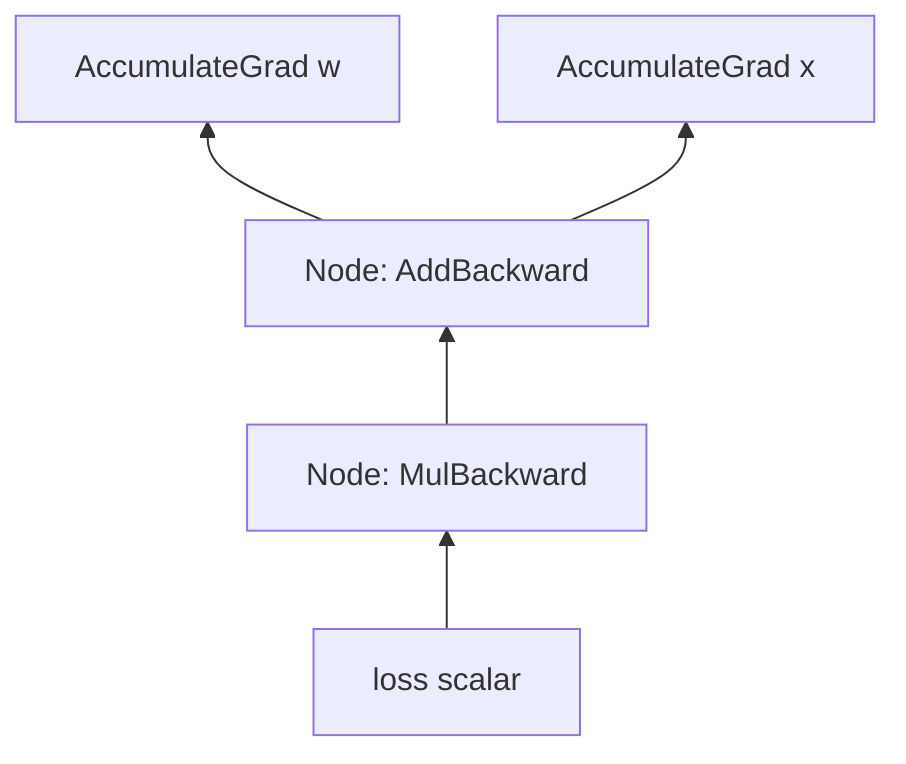
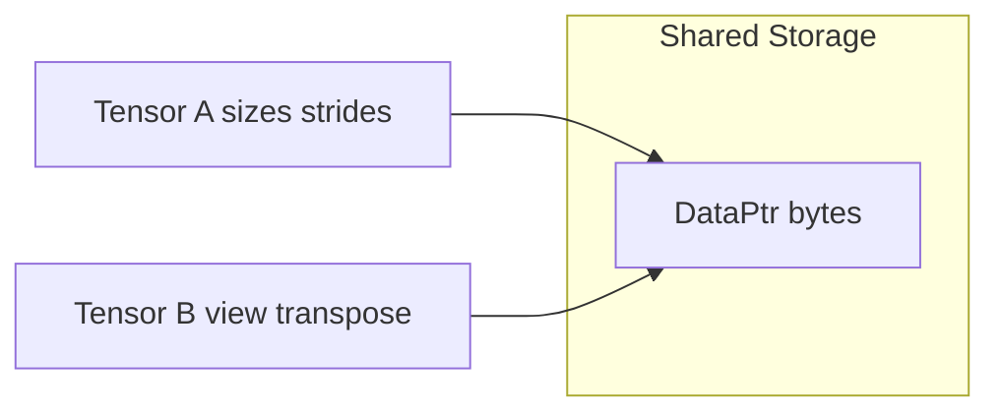
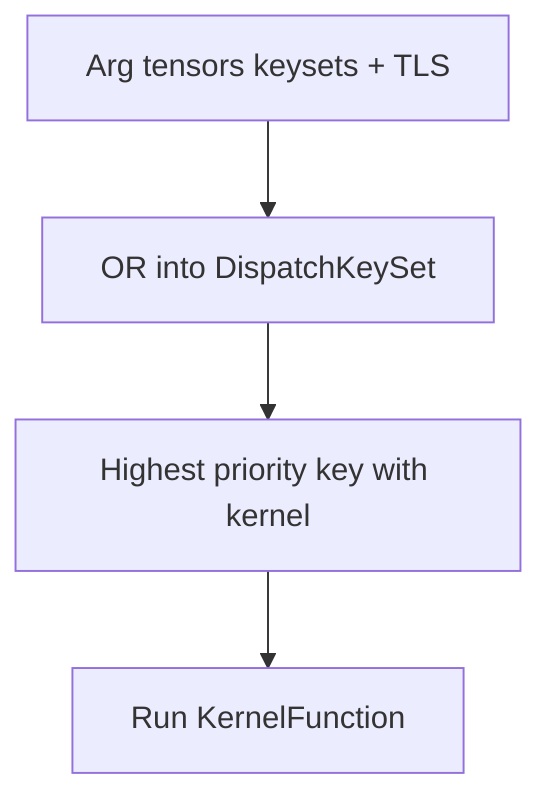

# 01 — Theory Primer

This page teaches only the concepts that the PyTorch core stack *depends on*.
Each section ends with “where it shows up in code.” Read this before diving into
c10/dispatcher/autograd implementation docs.

---

## 1. Reverse-mode automatic differentiation (backprop)

### Idea

A neural net is a composition of differentiable maps
\(f = f_n \circ \cdots \circ f_1\). Training needs gradients of a scalar loss
\(\ell\) w.r.t. parameters.

**Forward mode** AD pushes directional derivatives through the graph
(good when many outputs, few inputs).

**Reverse mode** AD (backpropagation) pulls *cotangent* / VJP information from
the scalar loss back to the inputs (good when few outputs—usually one loss—and
many inputs—parameters). PyTorch's default engine is reverse mode.

For a map \(y = f(x)\), the **vector-Jacobian product** (VJP) is:

\[
v^\top \frac{\partial f}{\partial x}
\]

Given upstream grad \(v = \frac{\partial \ell}{\partial y}\), the VJP yields
\(\frac{\partial \ell}{\partial x}\). Each op only needs its local VJP; chaining
them recovers the full gradient (chain rule).

### Why a DAG of Nodes works

During the forward pass, when an op runs under grad mode and inputs need grad,
PyTorch records a **Node** whose `apply` method implements that op's VJP.
Outputs point at the Node via `grad_fn`. Edges connect “this output” to “that
input slot of the previous Node.” Backward is a dependency-respecting walk that
feeds cotangents into each Node.



You do **not** store full Jacobians for large tensors; you store enough
**saved tensors / metadata** to compute the VJP later.

### Where it shows up

- Graph vertices: [`torch/csrc/autograd/node.h`](../torch/csrc/autograd/node.h)
- Edges: [`torch/csrc/autograd/edge.h`](../torch/csrc/autograd/edge.h)
- Engine: [`torch/csrc/autograd/engine.cpp`](../torch/csrc/autograd/engine.cpp)
- Formulas: [`tools/autograd/derivatives.yaml`](../tools/autograd/derivatives.yaml)
- User custom VJP: [`torch/autograd/function.py`](../torch/autograd/function.py)

Full implementation: [05-autograd-engine.md](05-autograd-engine.md).

---

## 2. Leaves, interiors, and `.grad`

- A **leaf** tensor was created by the user (or `Parameter`) with
  `requires_grad=True` and was not the result of an operation that built a
  `grad_fn`. Leaves accumulate into `.grad` via an `AccumulateGrad` node.
- An **interior** tensor has a `grad_fn`. Its intermediate gradient is usually
  discarded after flowing further unless you retain it (`retain_grad()`).

```python
w = torch.randn(3, requires_grad=True)  # leaf
y = w * 2                               # interior; y.grad_fn is set
loss = y.sum()
loss.backward()
# w.grad is populated; y.grad is None unless retain_grad()
```

Optimizer code almost always steps on **leaf Parameters**.

---

## 3. Tensor layouts: storage, sizes, strides

### Idea

A dense PyTorch tensor is not “a multidimensional array object that owns a
private buffer for each view.” It is:

1. A **storage** — a 1-D blob of bytes (plus allocator/device info).
2. A **view** onto that storage — sizes, strides, and storage offset.

Element at logical index \(i_0, i_1, \ldots\) lives at byte offset proportional
to:

\[
\text{offset} + \sum_k i_k \cdot \text{stride}_k
\]

**Contiguous** (for the default row-major memory format) means strides are the
“natural” ones: last dimension stride 1, and each prior stride is the product of
later sizes. Many kernels assume or prefer contiguous inputs; non-contiguous
tensors may force a copy (`contiguous()`) or a slower strided kernel.

**Views** (`transpose`, `view`, `narrow`, slicing) share storage and change
metadata. **Copies** (`clone`, some `to`/`cuda` paths) allocate new storage.



**Channels-last** (`MemoryFormat.ChannelsLast`) is a different stride convention
for NCHW-like tensors that can speed up some conv paths on CUDA—still the same
storage model, different strides.

### Why autograd cares

Inplace writes into storage that other tensors view can corrupt the forward
values needed for backward, or alias grads incorrectly. PyTorch tracks a
**version counter** on storage and view metadata (`DifferentiableViewMeta`) so
illegal inplace use raises rather than silently wrong grads.

### Where it shows up

- [`c10/core/TensorImpl.h`](../c10/core/TensorImpl.h)
- [`c10/core/Storage.h`](../c10/core/Storage.h)
- [`c10/core/MemoryFormat.h`](../c10/core/MemoryFormat.h)
- View notes in [`torch/csrc/autograd/variable.h`](../torch/csrc/autograd/variable.h)

Deep dive: [02-c10-tensor-and-storage.md](02-c10-tensor-and-storage.md).

---

## 4. Multiple dispatch (the dispatcher idea)

### Idea

The same logical op (`aten::add`) needs different implementations depending on:

- Device / backend (CPU, CUDA, …)
- Tensor “kind” (dense, sparse, quantized, nested, …)
- Cross-cutting functionality (Autograd bookkeeping, Python modes, …)

This is **multiple dispatch**: pick a kernel from a table keyed by features of
the *arguments* (and thread-local mode bits), not from a single virtual method
on one object.

PyTorch encodes features as bits in a **`DispatchKeySet`**. The dispatcher ORs
keys from arguments (and TLS), then selects the **highest-priority** key that
has a registered kernel for that operator.

After an Autograd kernel runs, it typically **excludes** Autograd keys from TLS
and **redispatches** so the next lookup hits the numeric backend—without
infinite recursion.



### Separate from dtype switching

Inside a CPU kernel you still often write:

```cpp
AT_DISPATCH_FLOATING_TYPES(dtype, "add", [&] {
  using scalar_t = ...;
  // loop
});
```

That is **compile-time/template dtype dispatch**, not the c10 Dispatcher.
Confusing the two is a common onboarding failure.

### Where it shows up

- [`c10/core/DispatchKey.h`](../c10/core/DispatchKey.h)
- [`c10/core/DispatchKeySet.h`](../c10/core/DispatchKeySet.h)
- [`aten/src/ATen/core/dispatch/Dispatcher.h`](../aten/src/ATen/core/dispatch/Dispatcher.h)

Deep dive: [03-dispatcher.md](03-dispatcher.md).

---

## 5. Inplace ops and versioning

### Idea

`x.add_(y)` mutates `x`'s storage. If `x` (or a view of `x`) was saved for
backward, mutation can make the saved value wrong. Autograd bumps a **version**
when inplace ops run (via the `ADInplaceOrView` dispatch key) and checks that
version when using saved tensors.

Rule of thumb for research code: prefer out-of-place ops while learning;
use inplace only when you understand aliasing.

### Where it shows up

- Note [ADInplaceOrView key] in [`c10/core/DispatchKey.h`](../c10/core/DispatchKey.h)
- Generated / manual ADInplaceOrView kernels under autograd codegen

---

## 6. Parameters vs buffers vs activations (nn theory)

| Kind | Learnable? | In `state_dict`? | Typical use |
|------|------------|------------------|-------------|
| Parameter | Yes | Yes | Weights, biases |
| Buffer | No | Yes (unless non-persistent) | `running_mean`, masks |
| Activation / activation grad | No | No | Forward intermediates |

`nn.Module` auto-registers `Parameter` and child `Module` assignments; a plain
`Tensor` attribute is **not** a parameter. That is a design choice, not a bug.

Deep dive: [06-nn-modules.md](06-nn-modules.md).

---

## 7. What an optimizer is doing

Given parameters \(\theta\) and gradients \(g = \nabla_\theta \ell\), an
optimizer applies an update rule. Adam maintains moments \(m, v\):

\[
m \leftarrow \beta_1 m + (1-\beta_1) g,\quad
v \leftarrow \beta_2 v + (1-\beta_2) g^2,\quad
\theta \leftarrow \theta - \eta \frac{\hat m}{\sqrt{\hat v}+\epsilon}
\]

Implementation concern is mostly **how** to apply this efficiently across
thousands of tensors (Python loop vs `_foreach_*` vs fused CUDA kernel), not
the algebra.

Deep dive: [07-optimizers.md](07-optimizers.md).

---

## 8. Composite ops and “free” autograd

If you implement `gelu` by calling `tanh`, `mul`, `add`, etc., reverse-mode
autograd already knows those pieces. Registering such an op as
**CompositeImplicitAutograd** means: “no separate `derivatives.yaml` entry;
decompose into ops that already have grads.”

If you write a closed-form CUDA kernel for the forward, you usually need an
**explicit** backward (via `derivatives.yaml` or a custom `autograd.Function`).

Deep dive: [04-aten-and-codegen.md](04-aten-and-codegen.md).

---

## Lab

1. Sketch VJPs by hand for `z = x * y` and `z = x @ w` (matrix multiply) with
   upstream `g`. Compare to what you see after:

   ```python
   x = torch.tensor([2.0], requires_grad=True)
   y = torch.tensor([3.0], requires_grad=True)
   z = x * y
   z.backward()
   print(x.grad, y.grad)
   ```

2. Create a view and mutate the base; observe the error under grad:

   ```python
   a = torch.randn(3, requires_grad=True)
   b = a[:2]
   c = b * 2
   a.add_(1)  # may break backward depending on path; try c.sum().backward()
   ```

3. Print strides:

   ```python
   t = torch.randn(2, 3)
   print(t.stride(), t.T.stride(), t.T.is_contiguous())
   ```

## Related files

- [`torch/csrc/autograd/node.h`](../torch/csrc/autograd/node.h) — graph commentary
- [`c10/core/TensorImpl.h`](../c10/core/TensorImpl.h) — layout fields
- [`c10/core/DispatchKey.h`](../c10/core/DispatchKey.h) — key taxonomy notes
- [`aten/src/ATen/native/README.md`](../aten/src/ATen/native/README.md) — Composite* keys

## Next

[02-c10-tensor-and-storage.md](02-c10-tensor-and-storage.md) — how tensors are represented in c10.
