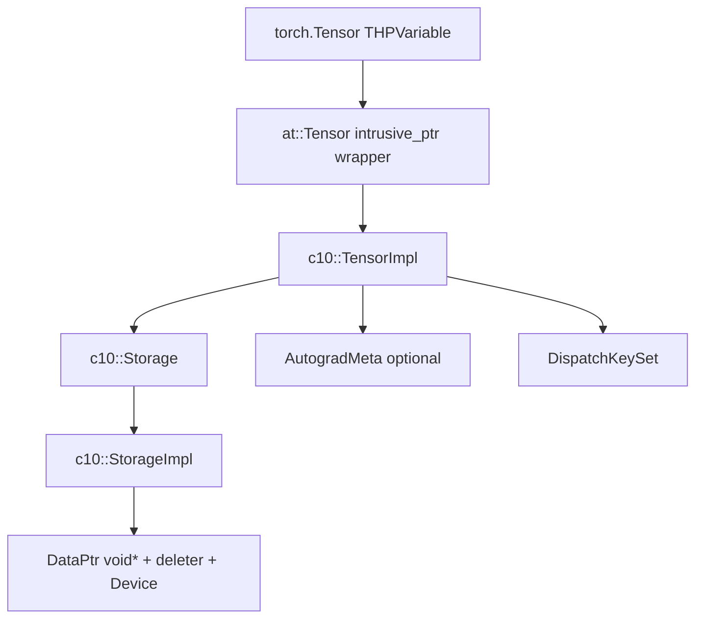

# 02 — c10: Tensor, Storage, and Core Types

## What is c10?

`c10` is PyTorch’s **minimal C++ core library**: devices, dtypes, storage,
allocators, and dispatch-key bits. It does **not** contain operator kernels.
Name lineage: consolidation of **C**affe2 + **A**Ten foundations into one
shared core (`c10/CMakeLists.txt` is its own project).

Theory refresh (layouts): [01-theory-primer.md](01-theory-primer.md)#3-tensor-layouts-storage-sizes-strides.

## Ownership diagram



| Type | Header | Role |
|------|--------|------|
| `at::Tensor` | generated `TensorBody` via [`aten/src/ATen/core/Tensor.h`](../aten/src/ATen/core/Tensor.h) | Public C++ handle (`intrusive_ptr<TensorImpl>`) |
| `TensorImpl` | [`c10/core/TensorImpl.h`](../c10/core/TensorImpl.h) | Sizes, strides, offset, dtype, keyset, optional AutogradMeta |
| `Storage` | [`c10/core/Storage.h`](../c10/core/Storage.h) | Handle to `StorageImpl` |
| `StorageImpl` | [`c10/core/StorageImpl.h`](../c10/core/StorageImpl.h) | Owns `DataPtr`, byte size, allocator, resizability |
| `DataPtr` | [`c10/core/Allocator.h`](../c10/core/Allocator.h) | Unique pointer + deleter + device |
| `ScalarType` | [`c10/core/ScalarType.h`](../c10/core/ScalarType.h) | Enum of element types |
| `Device` | [`c10/core/Device.h`](../c10/core/Device.h) | `(DeviceType, index)` |
| `TensorOptions` | [`c10/core/TensorOptions.h`](../c10/core/TensorOptions.h) | Factory kwargs: dtype, device, layout, … |
| `DispatchKey` / `DispatchKeySet` | [`c10/core/DispatchKey.h`](../c10/core/DispatchKey.h), [`DispatchKeySet.h`](../c10/core/DispatchKeySet.h) | Kernel selection features |
| `SymInt` | [`c10/core/SymInt.h`](../c10/core/SymInt.h) | Symbolic / dynamic shapes (compilers); know it exists |

## Tensor vs TensorImpl

Callers almost always hold `at::Tensor` / `torch.Tensor`. Metadata and the
pointer to storage live on **`TensorImpl`**, which is **intrusively
refcounted**. When the last `Tensor` referring to an impl goes away, the impl
(and possibly the storage) is freed.

**Views** create a new `TensorImpl` (new sizes/strides/offset) that points at
the **same** `StorageImpl`. That is the fundamental aliasing model.

```text
t = torch.randn(2, 3)
u = t.transpose(0, 1)   # new TensorImpl, same Storage
u[0, 0] = 42            # mutates shared bytes; visible via t
```

## Storage invariants

From headers and [`aten/src/README.md`](../aten/src/README.md) heritage notes:

1. **Storage uniquely owns the data pointer** in the common case (modulo
   `from_blob`, custom deleters, and copy-on-write).
2. **Aliasing ⇒ same storage** for ordinary views.
3. Allocators produce `DataPtr`s: CPU via [`c10/core/CPUAllocator.*`](../c10/core/CPUAllocator.h);
   CUDA caching allocator under [`c10/cuda/`](../c10/cuda/).

### Copy-on-write (COW)

Some paths use lazy clones that share an allocation until a write materializes
a private copy. Details and threading rules:
[`c10/core/impl/README-cow.md`](../c10/core/impl/README-cow.md). You do not need
COW to contribute to most ops; know that “same storage” is not always forever.

## Dtype, device, layout, memory format

```python
t = torch.empty(2, 3, dtype=torch.float32, device="cpu",
                memory_format=torch.contiguous_format)
```

| Concept | Meaning |
|---------|---------|
| `ScalarType` / dtype | Element type (`Float`, `BFloat16`, `Long`, …) |
| `Device` | Where the `DataPtr` lives (`cpu`, `cuda:0`, …) |
| `Layout` | Strided dense vs sparse layouts, etc. |
| `MemoryFormat` | Contiguous vs ChannelsLast vs Preserve, … |

Factories take `TensorOptions` aggregating these. Operator kernels usually
assume matching dtypes/devices among tensor arguments (with documented
promotion rules for some binary ops via TensorIterator).

## DispatchKeySet on TensorImpl

Each tensor carries a bitset of keys (e.g. dense CPU, AutogradCPU, …). The
dispatcher ORs argument keysets when looking up a kernel. Autograd and backend
keys are *features of the tensor + TLS*, not a separate Python object.

See [03-dispatcher.md](03-dispatcher.md).

## AutogradMeta is optional and lazy

`TensorImpl` holds `unique_ptr<AutogradMetaInterface>`. **`nullptr` means
defaults** (no grad). Materializing metadata only when needed keeps inference
tensors cheap. The concrete `AutogradMeta` type lives in libtorch
([`torch/csrc/autograd/variable.h`](../torch/csrc/autograd/variable.h)), registered
via a factory so c10 does not depend on autograd.

Fields you will see constantly:

| Field | Role |
|-------|------|
| `grad_` | Accumulated `.grad` for leaves |
| `grad_fn_` | Backward `Node` for interiors |
| `grad_accumulator_` | Leaf `AccumulateGrad` |
| `requires_grad_` | Leaf flag |
| `output_nr_` | Which output of `grad_fn` |
| view meta | `DifferentiableViewMeta` when applicable |

## Directory map under `c10/`

| Path | Purpose |
|------|---------|
| [`c10/core/`](../c10/core/) | Foundational types above |
| [`c10/core/impl/`](../c10/core/impl/) | Internal APIs — **no BC**; see README |
| [`c10/util/`](../c10/util/) | `ArrayRef`, `intrusive_ptr`, exceptions, Half, … |
| [`c10/macros/`](../c10/macros/) | `C10_API`, asserts |
| [`c10/cuda/`](../c10/cuda/) | Streams, guards, caching allocator wrappers (not kernels) |

## Version counters (preview)

`TensorImpl` participates in a version counter used by autograd to detect
inplace mutation of tensors that were saved for backward. Bumps happen when
inplace / view bookkeeping kernels run (`ADInplaceOrView`). Theory:
[01-theory-primer.md](01-theory-primer.md)#5-inplace-ops-and-versioning.

## Lab

1. Inspect identity of storage from Python:

   ```python
   import torch
   a = torch.randn(2, 3)
   b = a.t()
   print(a.untyped_storage().data_ptr() == b.untyped_storage().data_ptr())
   print(a.stride(), b.stride())
   ```

2. Open [`c10/core/TensorImpl.h`](../c10/core/TensorImpl.h) and find members for
   sizes, strides, storage, and `key_set_`. Skim comments; do not memorize every
   method.

3. Grep for `materialize_autograd_meta` under `torch/csrc/autograd/` to see when
   meta is created.

## First useful PRs in this area

- Fix incorrect comments / assert messages in c10 headers (with maintainer buy-in).
- Small allocator or Device guard bugfixes after reproducing with a tiny test.
- Avoid drive-by refactors of `TensorImpl` — it is ABI- and performance-sensitive.

## Related files

- [`c10/core/TensorImpl.h`](../c10/core/TensorImpl.h)
- [`c10/core/StorageImpl.h`](../c10/core/StorageImpl.h)
- [`c10/core/Allocator.h`](../c10/core/Allocator.h)
- [`c10/core/ScalarType.h`](../c10/core/ScalarType.h)
- [`c10/core/impl/README.md`](../c10/core/impl/README.md)
- [`torch/csrc/autograd/variable.h`](../torch/csrc/autograd/variable.h)

## Next

[03-dispatcher.md](03-dispatcher.md) — how ops choose a kernel.
