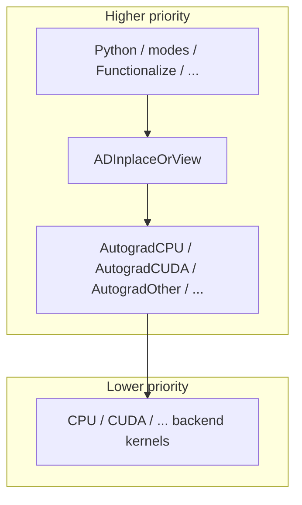
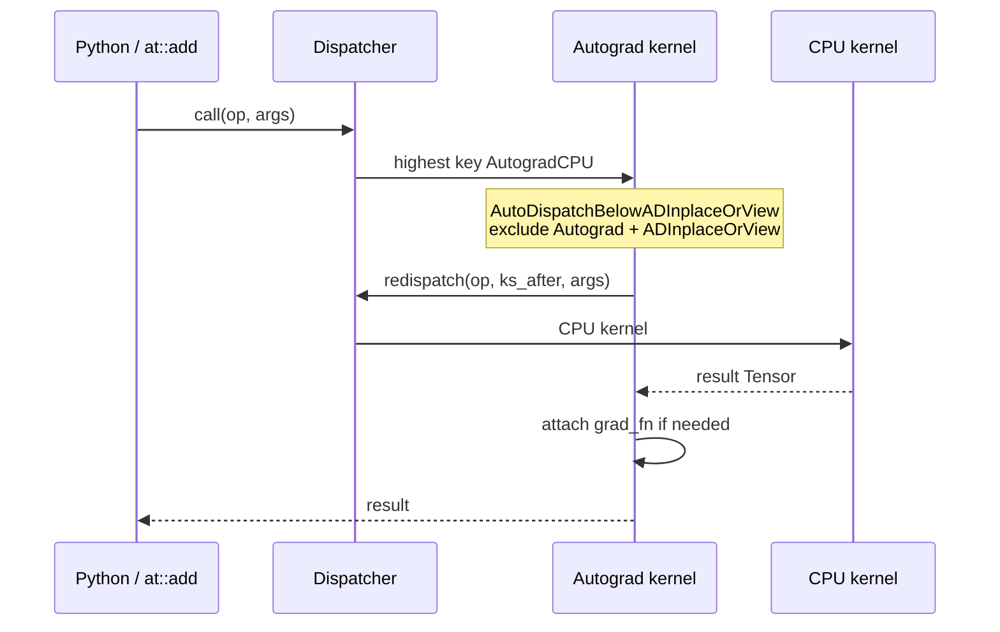

# 03 — The Dispatcher

## Theory (multiple dispatch)

See [01-theory-primer.md](01-theory-primer.md)#4-multiple-dispatch-the-dispatcher-idea.
Short version: each operator schema has a table of kernels keyed by
**DispatchKey**. At call time, PyTorch builds a **DispatchKeySet** from argument
tensors and thread-local state, then runs the kernel for the
**highest-priority** key that is registered.

## Where the code lives

| Path | Role |
|------|------|
| [`c10/core/DispatchKey.h`](../c10/core/DispatchKey.h) | Key enum + long design notes |
| [`c10/core/DispatchKeySet.h`](../c10/core/DispatchKeySet.h) | Bitset, priority |
| [`c10/core/impl/LocalDispatchKeySet.h`](../c10/core/impl/LocalDispatchKeySet.h) | TLS include / exclude |
| [`aten/src/ATen/core/dispatch/Dispatcher.h`](../aten/src/ATen/core/dispatch/Dispatcher.h) | Singleton `call` / `redispatch` |
| [`aten/src/ATen/core/dispatch/OperatorEntry.h`](../aten/src/ATen/core/dispatch/OperatorEntry.h) | Per-op kernel table |
| [`aten/src/ATen/core/dispatch/DispatchKeyExtractor.h`](../aten/src/ATen/core/dispatch/DispatchKeyExtractor.h) | Keyset from args |
| [`aten/src/ATen/core/dispatch/README.md`](../aten/src/ATen/core/dispatch/README.md) | Folder map |
| [`torch/library.h`](../torch/library.h) | `TORCH_LIBRARY` / `TORCH_LIBRARY_IMPL` |

## Backend bits vs functionality bits

`DispatchKey.h` splits concepts:

- **BackendComponent** — CPU, CUDA, Meta, PrivateUse1, … (which device family)
- **Functionality** — Dense, Sparse, Quantized, AutogradFunctionality, …

Many runtime keys are the cross product (e.g. `AutogradCPU`, `SparseCUDA`).
Higher bit index ⇒ handled first (count leading zeros on the keyset).

You do not need to memorize every key. You need the **priority band** for the
hot path:



Exact ordering is in the enum; read comments rather than trusting this sketch
for exotic keys.

## Alias keys you will hit constantly

| Alias key | Meaning |
|-----------|---------|
| `Autograd` | Default autograd wrappers; expands to backend-specific Autograd* keys |
| `CompositeImplicitAutograd` | Decompose into ops that already have autograd |
| `CompositeExplicitAutograd` | Backend-generic kernel; needs explicit derivatives for grads |
| `ADInplaceOrView` | Version bump / view meta setup |

**Note [Alias Dispatch Key : Autograd]** in `DispatchKey.h`: backends must not
register “autograd” behavior at the raw backend key (that runs *after*
Autograd). To override autograd for a backend, use `AutogradXLA` (etc.).

**Note [ADInplaceOrView key]** and **Note [Dream: skip VariableType…]**:
functional ops still go through Autograd wrappers today; the “dream” of
skipping them when `requires_grad=false` is documented as blocked by dispatch
cost tradeoffs. Inplace/view ops pay for `ADInplaceOrView` bookkeeping.

## Registration macros

Schemas are usually generated from [`native_functions.yaml`](../aten/src/ATen/native/native_functions.yaml).
Kernels register like:

```cpp
TORCH_LIBRARY(aten, m) {
  m.def("add.Tensor(Tensor self, Tensor other, *, Scalar alpha=1) -> Tensor");
}

TORCH_LIBRARY_IMPL(aten, CPU, m) {
  m.impl("add.Tensor", TORCH_FN(add_cpu));
}

TORCH_LIBRARY_IMPL(aten, Autograd, m) {
  m.impl("add.Tensor", TORCH_FN(/* VariableType::add */));
}
```

Public API: [`torch/library.h`](../torch/library.h).
Older `RegisterOperators` still appears in docs; prefer `TORCH_LIBRARY*` for new
code ([`op_registration/README.md`](../aten/src/ATen/core/op_registration/README.md)).

## `call` vs `redispatch`



- **`Dispatcher::call`**: compute keyset, pick kernel, invoke.
- **`redispatch`**: caller already computed / masked the keyset (after handling
  a higher key). Used heavily inside VariableType wrappers.

Guards like `at::AutoDispatchBelowAutograd` / `AutoDispatchBelowADInplaceOrView`
add keys to the TLS **exclude** set for the duration of the scope.

## Call graph: `torch.add` / `x + y`

```text
Python: x + y
  → tools/autograd generated python_*.cpp binding
  → at::add(x, y)   // ATen API → Dispatcher::call
  → OperatorEntry lookup
  → [often] VariableType::add  (Autograd*)
       → guard excludes Autograd (+ ADInplaceOrView for functional)
       → at::redispatch::add(...)
       → at::native::add / TensorIterator CPU or CUDA kernel
       → if GradMode and requires_grad: build AddBackward0, link edges
  → return Tensor
```

Codegen of the Autograd side: [`tools/autograd/gen_variable_type.py`](../tools/autograd/gen_variable_type.py),
templates under [`tools/autograd/templates/`](../tools/autograd/templates/).

## Custom ops without a VariableType formula

[`aten/src/ATen/core/VariableFallbackKernel.cpp`](../aten/src/ATen/core/VariableFallbackKernel.cpp)
registers Autograd* fallbacks: either fallthrough or “autograd not implemented.”
Real gradients for custom ops usually need `torch.autograd.Function` or an
explicit registration story.

## Lab

1. Read every `Note [` in [`c10/core/DispatchKey.h`](../c10/core/DispatchKey.h)
   related to Autograd and ADInplaceOrView (search the file).

2. From Python, peek at dispatch (approximate; APIs evolve):

   ```python
   import torch
   x = torch.randn(2, 2)
   # Conceptual: which keys are on the tensor
   print(x.device, x.dtype)
   ```

3. Grep one op:

   ```bash
   rg "func: add.Tensor" aten/src/ATen/native/native_functions.yaml
   ```

   Note its `dispatch:` entries.

4. Skim [`aten/src/ATen/core/dispatch/README.md`](../aten/src/ATen/core/dispatch/README.md).

## First useful PRs

- Improve comments / docs for a DispatchKey note that confused you.
- Fix fallthrough / missing kernel error messages.
- Out-of-tree backend registration examples (PrivateUse1) with tests—only with
  clear owner guidance.

## Related files

- [`c10/core/DispatchKey.h`](../c10/core/DispatchKey.h)
- [`aten/src/ATen/core/dispatch/Dispatcher.h`](../aten/src/ATen/core/dispatch/Dispatcher.h)
- [`torch/library.h`](../torch/library.h)
- [`aten/src/ATen/core/VariableFallbackKernel.cpp`](../aten/src/ATen/core/VariableFallbackKernel.cpp)

## Next

[04-aten-and-codegen.md](04-aten-and-codegen.md) — defining and implementing operators.
