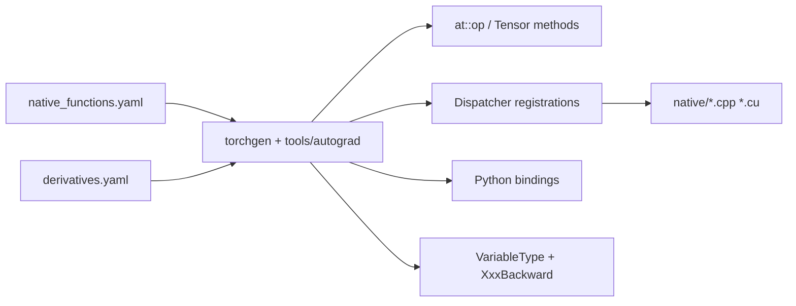
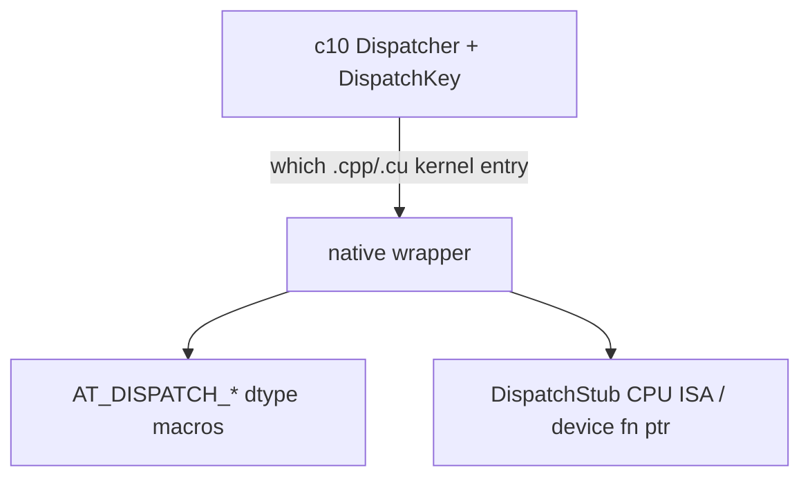

# 04 — ATen Operators and Codegen

## What is ATen?

ATen is the **tensor operator library**: schemas, generated C++/Python APIs, and
native implementations under [`aten/src/ATen/native/`](../aten/src/ATen/native/).
It sits on `c10` types and the dispatcher.

Primary authoring guide (read in full when you implement an op):
[`aten/src/ATen/native/README.md`](../aten/src/ATen/native/README.md).

## Pipeline overview



Treat **torchgen** ([`torchgen/`](../torchgen/)) as a black-box compiler whose
**inputs** (`native_functions.yaml`, related YAML) and **outputs** (generated
registrations, headers under the build tree, Python bindings) you must
understand. You rarely edit generated sources by hand.

## `native_functions.yaml`

Path: [`aten/src/ATen/native/native_functions.yaml`](../aten/src/ATen/native/native_functions.yaml)
(~tens of thousands of lines — search, don't scroll).

Minimal shape:

```yaml
- func: add.Tensor(Tensor self, Tensor other, *, Scalar alpha=1) -> Tensor
  variants: function, method
  dispatch:
    CPU: add_cpu
    CUDA: add_cuda
```

Fields that matter early:

| Field | Why |
|-------|-----|
| `func` | Schema name, overload, types, returns |
| `variants` | `function` (`at::op`) and/or `method` (`t.op()`) |
| `dispatch` | Per-key kernel names, or Composite* |
| Alias annotations | `Tensor(a)`, `Tensor(a!)` for views / inplace |
| `device_guard` / `device_check` | Device placement behavior |

### Annotations (aliasing)

From the native README:

- `Tensor(a)` — may alias set `a`
- `Tensor(a!)` — may write through set `a` (inplace)
- More complex forms for view/inplace combinations

Wrong annotations break functionalization, autograd views, and compilers. When
in doubt, copy a similar existing op and ask in review.

### Factory functions

Ops with no tensor inputs (or marked `category_override: factory`) create
tensors and are codegen'd specially (device/dtype from kwargs / options).

## CompositeImplicit vs CompositeExplicit

| Registration | Forward | Autograd |
|--------------|---------|----------|
| **CompositeImplicitAutograd** | Written as other `at::` ops | **Free** — compose existing grads |
| **CompositeExplicitAutograd** | Often one structured kernel | Needs [`derivatives.yaml`](../tools/autograd/derivatives.yaml) (or equivalent) |
| Per-backend `CPU`/`CUDA` | Backend kernel | Usually needs explicit derivatives unless only called under Implicit composites |

Default when `dispatch:` is omitted is CompositeImplicit-style behavior (see
native README for current exact rules).

**Historical names:** Math ≈ CompositeImplicit; DefaultBackend ≈
CompositeExplicit. See [12-history-and-design.md](12-history-and-design.md).

## Three “dispatch” words (again)



1. **Dispatcher** — Autograd vs CPU vs CUDA vs Sparse … ([03-dispatcher.md](03-dispatcher.md))
2. **`AT_DISPATCH_*`** — [`aten/src/ATen/Dispatch.h`](../aten/src/ATen/Dispatch.h) (also V2)
3. **`DispatchStub`** — [`aten/src/ATen/native/DispatchStub.h`](../aten/src/ATen/native/DispatchStub.h) +
   [`native/cpu/README.md`](../aten/src/ATen/native/cpu/README.md)

## Kernel organization patterns

### Pattern A — Composite / high-level

Implement by calling other ATen ops in a `.cpp` under `native/` (e.g. pieces of
`BinaryOps.cpp`, `ReduceOps.cpp`). Prefer this when numerics are expressible
that way.

### Pattern B — TensorIterator + dtype macros

Typical elementwise:

1. Build `TensorIterator` / `TensorIteratorConfig`
   ([`aten/src/ATen/TensorIterator.h`](../aten/src/ATen/TensorIterator.h))
2. Handle broadcasting, type promotion, output allocation
3. `AT_DISPATCH_*` + loop over pointers

### Pattern C — `DispatchStub` (CPU ISA)

For kernels that need AVX2/AVX512 variants:

1. `DECLARE_DISPATCH` in a header
2. `DEFINE_DISPATCH` outside `cpu/`
3. Kernel in `native/cpu/*.cpp` (anonymous namespace)
4. `REGISTER_DISPATCH` / AVX512 variants
5. Call `stub(kCPU, ...)` from the native function

**`native/cpu/` is only for multi-ISA recompilation**, not every CPU kernel.

### Pattern D — CUDA

- Host glue: `native/*.cpp` or `native/cuda/*.cpp`
- Device code: `native/cuda/*.cu`
- Often the same stub pattern with a CUDA registration
- Fused optim examples: `FusedAdam*` under native/cuda (used by `torch.optim`)

## Directory map (`aten/src/ATen/`)

| Area | Role |
|------|------|
| `native/` | Operator implementations + yaml |
| `core/` | Mobile-sensitive subset: dispatcher, lists; see `core/README.md` |
| `cuda/`, `cpu/`, … | Device helpers (streams, contexts)—not all kernels |
| `Dispatch.h`, `TensorIterator.h` | Cross-cutting helpers |

Legacy notes: [`aten/src/README.md`](../aten/src/README.md) (TH heritage, refcounting).

## Pairing with autograd

```text
Add / change forward in native_functions.yaml + native kernel
  → if CompositeImplicit: done for grads
  → else: add / update tools/autograd/derivatives.yaml
       → codegen emits VariableType wrapper + XxxBackward Node
```

Details: [05-autograd-engine.md](05-autograd-engine.md).

## Lab

1. Trace `relu`:

   ```bash
   rg -n "func: relu" aten/src/ATen/native/native_functions.yaml
   ```

   Open the listed dispatch target `.cpp` and see if it is Composite or backend.

2. Open [`aten/src/ATen/native/README.md`](../aten/src/ATen/native/README.md)
   sections on annotations and Composite* keys.

3. Find one `DECLARE_DISPATCH` usage:

   ```bash
   rg -n "DECLARE_DISPATCH" aten/src/ATen/native --glob '*.h' | head
   ```

## First useful PRs

- Fix a CompositeImplicit decomposition bug (wrong formula) with a Python test.
- Add a missing dtype to an `AT_DISPATCH_*` list when supported elsewhere.
- Small native README clarification from a confusion you actually hit.
- Later: new structured kernel + `derivatives.yaml` entry (months 4–5).

## Related files

- [`aten/src/ATen/native/native_functions.yaml`](../aten/src/ATen/native/native_functions.yaml)
- [`aten/src/ATen/native/README.md`](../aten/src/ATen/native/README.md)
- [`aten/src/ATen/TensorIterator.h`](../aten/src/ATen/TensorIterator.h)
- [`aten/src/ATen/Dispatch.h`](../aten/src/ATen/Dispatch.h)
- [`torchgen/gen.py`](../torchgen/gen.py) (entry; treat as compiler)
- [`tools/autograd/derivatives.yaml`](../tools/autograd/derivatives.yaml)

## Next

[05-autograd-engine.md](05-autograd-engine.md) — how gradients are recorded and executed.
