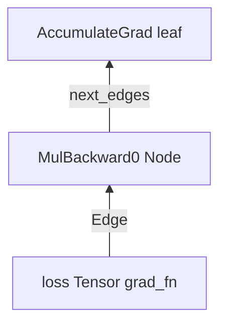
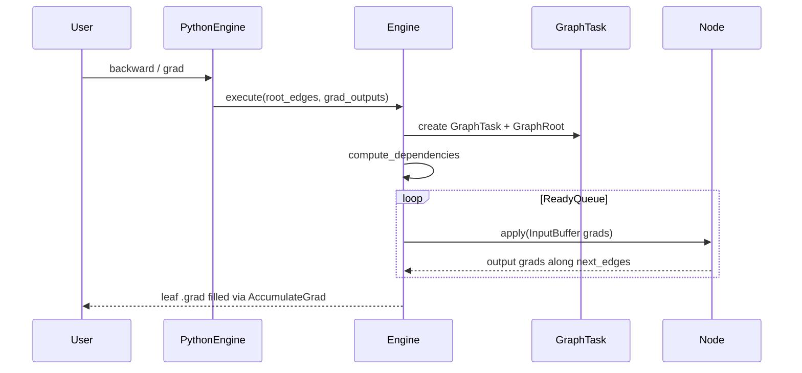

# 05 — Autograd Engine

## Theory first

Reverse-mode AD, VJPs, leaves vs interiors:
[01-theory-primer.md](01-theory-primer.md)#1-reverse-mode-automatic-differentiation-backprop.

Dual C++/Python types overview:
[`torch/csrc/autograd/README.md`](../torch/csrc/autograd/README.md).

## Variable ≡ Tensor

```cpp
// torch/csrc/autograd/variable.h (conceptually)
using Variable = at::Tensor;
```

Historically Variable wrapped Tensor. Today they are the same object; autograd
state lives in **`AutogradMeta`** on `TensorImpl` ([02-c10-tensor-and-storage.md](02-c10-tensor-and-storage.md)).
Python still exposes a legacy alias `torch.autograd.Variable`.

## Graph vocabulary

From [`torch/csrc/autograd/node.h`](../torch/csrc/autograd/node.h):

| Concept | Meaning |
|---------|---------|
| **`Node`** | Vertex of the graph; `apply(grads) → grads` implements a VJP |
| **`Edge`** | `{intrusive_ptr<Node>, input_nr}` — which input slot of which Node |
| **`Variable`/`Tensor`** | Values that flow; carry `grad_fn` / accumulator metadata |
| **`SavedVariable`** | Saved tensors/metadata needed to run `apply` later |
| **`AccumulateGrad`** | Leaf sink that writes `.grad` |

Naming history: C++ type was once called Function; it is now **`Node`**. Python
still says `torch.autograd.Function` and `tensor.grad_fn`.



When multiple edges target the same input, grads are **summed** (via
`InputBuffer`) before `apply`.

## Forward: building the graph

Typical generated Autograd kernel (VariableType) does:

1. Check `GradMode` / `requires_grad` / forward-AD needs.
2. Enter `AutoDispatchBelowADInplaceOrView` (or BelowAutograd) guard.
3. `at::redispatch::op(...)` into numeric kernels.
4. If differentiation is needed:
   - Construct `XxxBackward` Node (from `derivatives.yaml` formulas).
   - `collect_next_edges(inputs)` → Node's `next_edges_`.
   - Save tensors as `SavedVariable` as required by the formula.
   - `create_gradient_edge(output, node)` sets `grad_fn` / `output_nr`.

Codegen:

| Piece | Path |
|-------|------|
| Formulas | [`tools/autograd/derivatives.yaml`](../tools/autograd/derivatives.yaml) |
| Orchestration | [`tools/autograd/gen_autograd.py`](../tools/autograd/gen_autograd.py) |
| Wrappers | [`tools/autograd/gen_variable_type.py`](../tools/autograd/gen_variable_type.py) |
| Nodes | [`tools/autograd/gen_autograd_functions.py`](../tools/autograd/gen_autograd_functions.py) |
| Inplace/view | [`tools/autograd/gen_inplace_or_view_type.py`](../tools/autograd/gen_inplace_or_view_type.py) |
| Output (build) | `torch/csrc/autograd/generated/` |

Hand-written pieces: [`FunctionsManual.*`](../torch/csrc/autograd/),
[`VariableTypeManual.cpp`](../torch/csrc/autograd/VariableTypeManual.cpp),
[`functions/`](../torch/csrc/autograd/functions/) (`AccumulateGrad`, …).

## Backward: Engine



Key types:

| Type | Path | Role |
|------|------|------|
| `Engine` | [`engine.h`](../torch/csrc/autograd/engine.h) / [`engine.cpp`](../torch/csrc/autograd/engine.cpp) | Worker threads, ready queues, reentrant backward |
| `PythonEngine` | [`python_engine.cpp`](../torch/csrc/autograd/python_engine.cpp) | GIL-aware specialization |
| `GraphTask` | [`graph_task.h`](../torch/csrc/autograd/graph_task.h) | One backward run: deps, exec_info, errors |
| `InputBuffer` | [`input_buffer.h`](../torch/csrc/autograd/input_buffer.h) | Accumulate grads per input slot |

Public Python entry: [`torch/autograd/__init__.py`](../torch/autograd/__init__.py)
(`backward`, `grad`), graph helpers in [`torch/autograd/graph.py`](../torch/autograd/graph.py).

Ordering uses **sequence numbers** / topological numbers on Nodes so the ready
queue processes the DAG correctly (see comments in `node.h`).

## Custom autograd: Python `Function`

```python
class MulConstant(torch.autograd.Function):
    @staticmethod
    def forward(ctx, x, constant):
        ctx.constant = constant
        return x * constant

    @staticmethod
    def backward(ctx, grad_output):
        return grad_output * ctx.constant, None
```

Bridge to the C++ graph:

| Piece | Path |
|-------|------|
| Python API | [`torch/autograd/function.py`](../torch/autograd/function.py) |
| `THPFunction` | [`python_function.h`](../torch/csrc/autograd/python_function.h) |
| `PyNode` | subclass of `Node` that calls into Python |
| C++ API | [`custom_function.h`](../torch/csrc/autograd/custom_function.h) |

From the autograd README: `PyNode` is **not** a Python object; it is a C++
`Node` that forwards `apply` to `THPFunction`.

## Grad modes

| API | Effect |
|-----|--------|
| `torch.no_grad()` | Disable grad recording (still some tracking differences vs inference) |
| `torch.enable_grad()` | Re-enable inside no_grad |
| `torch.inference_mode()` | Stronger: views/inference optimizations; cannot leave inference tensors into autograd unexpectedly |
| `torch.set_grad_enabled` | Imperative toggle |

Python: [`torch/autograd/grad_mode.py`](../torch/autograd/grad_mode.py).
C++: `AutoGradMode`, `AutoDispatchBelow*`, etc.

## Views and inplace

- View ops set up `DifferentiableViewMeta` (ADInplaceOrView).
- Inplace ops bump version counters.
- Saved variables validate versions on backward.

See Note [Autograd View Variables] in
[`variable.h`](../torch/csrc/autograd/variable.h) and
[13-common-pitfalls.md](13-common-pitfalls.md).

## Forward-mode AD

Exists (`torch.autograd.forward_ad`, `fw_grad_` on meta). Default training uses
reverse mode. Know the module exists; deep dive when you need dual-level
numbers.

## Package map

### Python [`torch/autograd/`](../torch/autograd/)

| File | Role |
|------|------|
| `function.py` | Custom Function |
| `graph.py` | Hooks, engine entry |
| `grad_mode.py` | no_grad / inference_mode |
| `functional.py` | jacobian, hessian helpers |
| `gradcheck.py` | Numerical checks |
| `anomaly_mode.py` | Detect NaN grad origins |

### C++ [`torch/csrc/autograd/`](../torch/csrc/autograd/)

| File | Role |
|------|------|
| `node.h`, `edge.h` | Graph core |
| `variable.h`, `autograd_meta.cpp` | Meta on tensors |
| `engine.cpp` | Backward scheduling |
| `saved_variable.*` | Saved tensors |
| `generated/` | Codegen output (build) |

## Lab

1. Print the graph:

   ```python
   import torch
   x = torch.randn(2, 2, requires_grad=True)
   y = (x ** 2).sum()
   print(y.grad_fn)
   print(y.grad_fn.next_functions)
   ```

2. Read the “Nodes in the Autograd Graph” comment block in
   [`node.h`](../torch/csrc/autograd/node.h).

3. Pick one formula in [`derivatives.yaml`](../tools/autograd/derivatives.yaml)
   for `mul` or `add` and match it to the VJP you expect.

4. Write a 5-line custom `Function` and `gradcheck` it.

## First useful PRs

- Improve an error message for inplace-on-view.
- Fix a derivatives.yaml formula with a clear numerical test (`gradcheck`).
- Document a Node edge case you hit while debugging.

## Related files

- [`torch/csrc/autograd/README.md`](../torch/csrc/autograd/README.md)
- [`torch/csrc/autograd/node.h`](../torch/csrc/autograd/node.h)
- [`torch/csrc/autograd/engine.cpp`](../torch/csrc/autograd/engine.cpp)
- [`torch/csrc/autograd/variable.h`](../torch/csrc/autograd/variable.h)
- [`tools/autograd/derivatives.yaml`](../tools/autograd/derivatives.yaml)
- [`torch/autograd/function.py`](../torch/autograd/function.py)

## Next

[06-nn-modules.md](06-nn-modules.md) — how Modules sit on top of ops and autograd.
