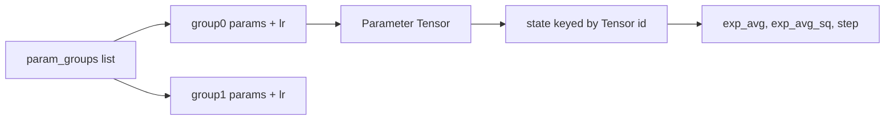
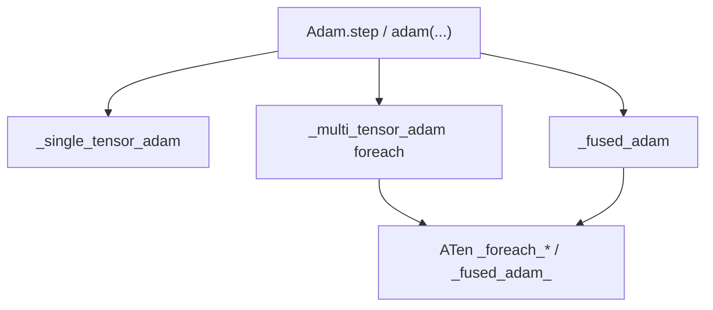

# 07 — `torch.optim`

## Theory first

[01-theory-primer.md](01-theory-primer.md)#7-what-an-optimizer-is-doing.

Optimizers **do not compute gradients**. They consume `param.grad` (usually
filled by autograd) and update parameter storage according to an algorithm
(SGD, Adam, …), maintaining algorithm state (moments, step count, …).

## Package layout

| Path | Role |
|------|------|
| [`torch/optim/optimizer.py`](../torch/optim/optimizer.py) | **`Optimizer` base**, hooks, foreach helpers |
| [`torch/optim/adam.py`](../torch/optim/adam.py), `sgd.py`, … | Algorithms |
| [`torch/optim/_functional.py`](../torch/optim/_functional.py) | Re-exports functional APIs |
| [`torch/optim/_stateless.py`](../torch/optim/_stateless.py) | Swap params/state (advanced trainers) |
| [`torch/optim/lr_scheduler.py`](../torch/optim/lr_scheduler.py) | LR schedules |
| [`torch/optim/swa_utils.py`](../torch/optim/swa_utils.py) | SWA |

No README in this tree—docstrings on `Optimizer` and each algorithm are the
local docs.

## `Optimizer` state model

```python
self.defaults: dict                 # hyperparameter defaults
self.state: defaultdict[Tensor, dict]  # per-parameter algorithm state
self.param_groups: list[dict]       # each has "params" + hyperparam overrides
```



- **`param_groups`:** allow different hyperparameters per subset (backbone vs
  head learning rates).
- **`state`:** keyed by **parameter Tensor identity**. Lazily allocated on first
  `step` that sees a grad. Checkpointing remaps tensor keys ↔ integer ids in
  `state_dict` / `load_state_dict`.

## Lifecycle

```text
opt = Adam(model.parameters(), lr=1e-3)
...
loss.backward()     # fills param.grad
opt.step()          # updates params using grads + state
opt.zero_grad()     # clears grads (set_to_none=True preferred for perf)
```

`step` is abstract on the base; subclasses implement it—often gather tensors
then call a **functional** kernel.

## Class API vs functional API

**Class API:** owns groups/state; `step` / `zero_grad` / hooks.

**Functional API:** e.g. `adam(params, grads, exp_avgs, ...)` in
[`adam.py`](../torch/optim/adam.py). Caller owns all tensor lists. Used by:

- the class `step` itself
- distributed / capturable / compiled training paths
- custom trainers that externalize state

## Three implementation tiers



| Tier | What | When |
|------|------|------|
| **single_tensor** | Python loop, one param at a time | Fallback; `differentiable=True` paths |
| **foreach / multi_tensor** | Batched `_foreach_*` ops | Default preference when supported |
| **fused** | Fused CUDA/XPU kernels (`torch._fused_adam_`, …) | `fused=True` on supported devices |

Selection logic lives in helpers like `_default_to_fused_or_foreach` in
`optimizer.py` / algorithm modules. Flags you will see: `foreach`, `fused`,
`capturable`, `differentiable`, `maximize`.

Fused kernels ultimately land in ATen (e.g. `native/cuda/FusedAdamKernel.cu`
and friends)—optimizer Python is the orchestrator.

## Hooks

- Instance: `register_step_pre_hook` / `register_step_post_hook`
- Global: `register_optimizer_step_pre_hook` / `post_hook`
- state_dict load/save hooks

Useful for logging, custom clipping integration, and some distributed wrappers.

## Schedulers

[`lr_scheduler.py`](../torch/optim/lr_scheduler.py) mutates
`param_groups[*]["lr"]` (and related fields) over time. They wrap an
`Optimizer`; they are not a separate autograd concept.

## `_stateless` swap

[`_stateless.py`](../torch/optim/_stateless.py) supports swapping live parameters
and optimizer state in/out—relevant to FSDP-style and functional training.
Treat as advanced; read when your work needs it.

## Lab

1. Read `Optimizer.__init__` / `add_param_group` /
   `state_dict` in [`optimizer.py`](../torch/optim/optimizer.py).

2. Step once and inspect state:

   ```python
   import torch, torch.nn as nn
   m = nn.Linear(3, 2)
   opt = torch.optim.Adam(m.parameters(), lr=1e-2)
   m(torch.randn(4, 3)).sum().backward()
   opt.step()
   p = next(m.parameters())
   print(opt.state[p].keys())
   ```

3. In [`adam.py`](../torch/optim/adam.py), find `def adam(` and see the branch
   that selects fused vs foreach vs single.

4. Optional: compare `fused=True` vs default on CUDA with a tiny benchmark
   (same device, many parameters).

## First useful PRs

- Fix foreach/fused numerical parity bugs with tests.
- Improve error when `fused` is requested on unsupported dtype/device.
- Docstring clarity on capturable/differentiable interactions.
- New algorithm: follow existing file structure (class + functional + tiers).

## Related files

- [`torch/optim/optimizer.py`](../torch/optim/optimizer.py)
- [`torch/optim/adam.py`](../torch/optim/adam.py)
- [`torch/optim/sgd.py`](../torch/optim/sgd.py)
- [`torch/optim/lr_scheduler.py`](../torch/optim/lr_scheduler.py)
- ATen fused kernels under `aten/src/ATen/native/cuda/` (`FusedAdam*`)

## Next

[08-end-to-end-training-step.md](08-end-to-end-training-step.md) — stitch
Module + autograd + optimizer into one walkthrough.
