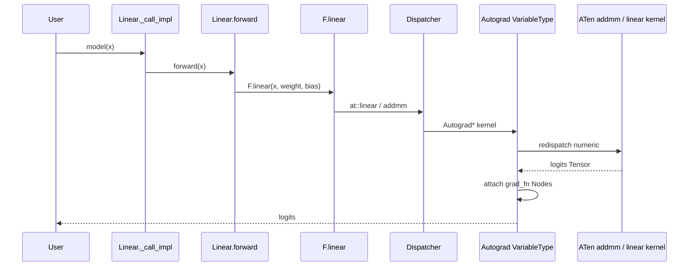
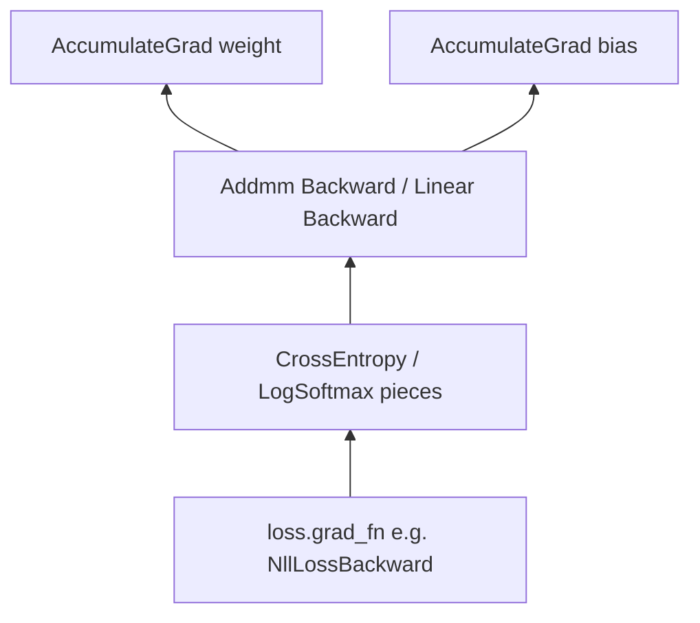
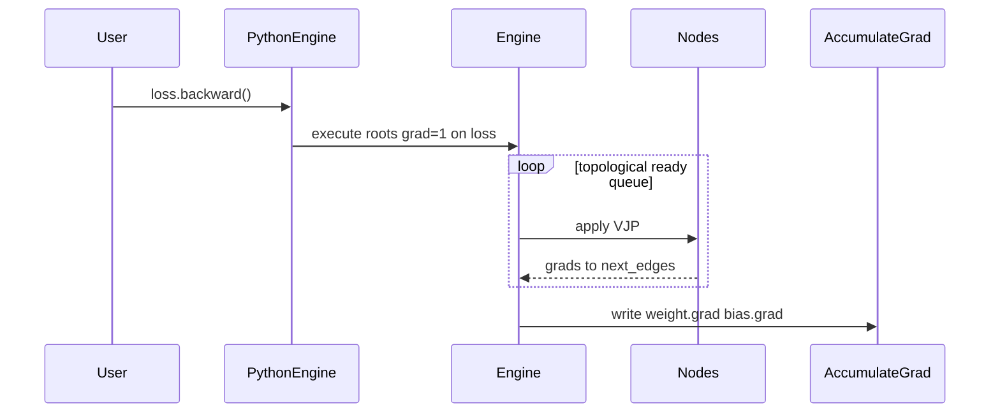

# 08 — End-to-End Training Step

This page traces one minimal training step through every layer in scope.
Keep it open while reading code; it is the “map on the wall.”

Companion diagrams: [diagrams/call-graphs.md](diagrams/call-graphs.md).

## The program

```python
import torch
import torch.nn as nn
import torch.nn.functional as F

torch.manual_seed(0)
model = nn.Linear(4, 3)
opt = torch.optim.Adam(model.parameters(), lr=1e-2)

x = torch.randn(2, 4)
target = torch.tensor([0, 2])

opt.zero_grad(set_to_none=True)
logits = model(x)                         # forward
loss = F.cross_entropy(logits, target)  # loss
loss.backward()                         # backward
opt.step()                              # update
```

We ignore DataLoader, AMP, distributed, and `torch.compile`.

---

## Phase 1 — Construction

```text
nn.Linear.__init__
  → Module.__init__ (empty _parameters/_modules/…)
  → self.weight = Parameter(empty[out, in])   # __setattr__ registers
  → self.bias = Parameter(empty[out])
  → reset_parameters() → nn.init.kaiming_uniform_ / uniform_

Adam.__init__
  → Optimizer.__init__(params, defaults)
  → param_groups[0]["params"] = [weight, bias]
  → state empty until first step
```

Files: [`linear.py`](../torch/nn/modules/linear.py),
[`module.py`](../torch/nn/modules/module.py),
[`parameter.py`](../torch/nn/parameter.py),
[`optimizer.py`](../torch/optim/optimizer.py),
[`adam.py`](../torch/optim/adam.py).

At this point Parameters are **leaves** with `requires_grad=True` and no
`grad_fn`.

---

## Phase 2 — Forward (`model(x)`)



Step by step:

1. `Module.__call__` → `_wrapped_call_impl` → `_call_impl`.
2. No hooks ⇒ fast path → `Linear.forward`.
3. `F.linear(input, weight, bias)` enters ATen (exact schema may be `linear` or
   decompose to `addmm` depending on shapes/codegen—follow the yaml).
4. Dispatcher selects Autograd wrapper, then numeric CPU/CUDA kernel.
5. Because `weight`/`bias` require grad, outputs get `grad_fn` and Nodes link
   back toward `AccumulateGrad` for each Parameter.
6. `x` does not require grad ⇒ no grad accumulation into `x` unless you set it.

Also see [06-nn-modules.md](06-nn-modules.md), [03-dispatcher.md](03-dispatcher.md),
[05-autograd-engine.md](05-autograd-engine.md).

---

## Phase 3 — Loss (`F.cross_entropy`)

```text
F.cross_entropy(logits, target)
  → ATen cross_entropy / nll_loss path (dispatch + possible composites)
  → Autograd wrapper saves what derivatives.yaml needs
  → loss: 0-dim Tensor with grad_fn
```

`target` is integer class indices—typically non-differentiable. The graph roots
backward at `loss`.

---

## Phase 4 — Graph shape after forward (conceptual)



Exact Node class names depend on the decomposition (`cross_entropy` may be
several Nodes). Inspect with:

```python
print(loss.grad_fn)
print(loss.grad_fn.next_functions)
```

```text
<NllLossBackward0 object at 0x7e7a258a96c0>
((<LogSoftmaxBackward0 object at 0x7e7a2334c3a0>, 0),)
```

Leaves (`weight`, `bias`) appear as `AccumulateGrad` sinks via
`next_functions`, not as `grad_fn` on the Parameter itself (`param.grad_fn`
is `None` for leaves).

---

## Phase 5 — Backward (`loss.backward()`)



Mechanics ([05-autograd-engine.md](05-autograd-engine.md)):

1. Root edge from `loss` with upstream grad `1` (scalar).
2. `GraphTask` + dependency counts.
3. Each Node’s `apply` runs its VJP using saved tensors.
4. `AccumulateGrad` adds into `Parameter.grad` (or sets if none).

After backward: `model.weight.grad` and `model.bias.grad` are dense tensors
matching parameter shapes (unless you used sparse layouts—out of scope).

---

## Phase 6 — Optimizer step

```text
Adam.step()
  → for each param group: collect params with grads
  → _init_group: allocate exp_avg / exp_avg_sq / step in opt.state[p] if needed
  → adam(...) functional
       → _fused_adam or _multi_tensor_adam or _single_tensor_adam
       → ATen foreach / fused kernels mutate parameter storage in-place
```

Parameters remain the **same Tensor objects** (identity preserved—important
because `opt.state` is keyed by identity). Storage bytes change.

Then typically `opt.zero_grad(set_to_none=True)` before the next iteration.

Files: [07-optimizers.md](07-optimizers.md), [`adam.py`](../torch/optim/adam.py).

---

## Full stack checklist (print and tick)

| Layer | What happened in this step |
|-------|----------------------------|
| `nn.Module` | Registered params; `__call__` → `forward` → `F.linear` |
| `nn.functional` | Stateless entry to ATen |
| Dispatcher | Autograd* then CPU/CUDA kernels for linear + CE |
| Autograd forward | Built Node/Edge DAG; saved tensors |
| Autograd Engine | Ran VJPs; filled `.grad` |
| c10 TensorImpl | Same impl for params; grads are separate TensorImpls |
| Storage | Param storages updated in-place by Adam |
| `Optimizer` | Created moments in `state`; applied update |

---

## Where to set breakpoints (C++)

If you have a debug build:

1. `Engine::execute` — [`engine.cpp`](../torch/csrc/autograd/engine.cpp)
2. A generated VariableType addmm/linear wrapper under
   `torch/csrc/autograd/generated/` (build tree)
3. Native kernel for your device under `aten/src/ATen/native/`

Python-only:

```python
print(logits.grad_fn)
for name, p in model.named_parameters():
    print(name, p.grad is not None, None if p.grad is None else p.grad.norm().item())
```

---

## Lab

1. Run the program above; print `loss.grad_fn` chain depth.
2. Replace `Adam` with `SGD` and compare `opt.state[p]` keys after one step.
3. Call `logits.sum().backward()` **without** `retain_graph` twice—observe the
   error; explain using freed graph Nodes.
4. Trace `linear` / `cross_entropy` in `native_functions.yaml`.

## Related files

- [`torch/nn/modules/linear.py`](../torch/nn/modules/linear.py)
- [`torch/nn/modules/module.py`](../torch/nn/modules/module.py)
- [`torch/csrc/autograd/engine.cpp`](../torch/csrc/autograd/engine.cpp)
- [`torch/optim/adam.py`](../torch/optim/adam.py)
- [`diagrams/call-graphs.md`](diagrams/call-graphs.md)

## Next

[09-coding-conventions.md](09-coding-conventions.md) — how to write code that
fits these systems.
