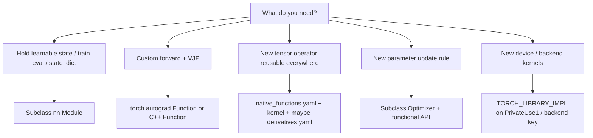

# 11 — Extension Points

Decision guide for “I need new behavior—where do I plug in?”



---

## 1. Custom `nn.Module`

**Use when:** you need parameters, buffers, submodules, hooks, `state_dict`,
`train`/`eval`.

**How:**

```python
class MyBlock(nn.Module):
    def __init__(self, d):
        super().__init__()
        self.w = nn.Parameter(torch.randn(d, d))
    def forward(self, x):
        return F.linear(x, self.w)
```

**Also:**

- Hooks / parametrizations / prune utilities
- `LazyModuleMixin` + `UninitializedParameter` for deferred shapes
- `get_extra_state` / `_version` for checkpoint evolution

Docs: [06-nn-modules.md](06-nn-modules.md).

---

## 2. Custom `torch.autograd.Function`

**Use when:** you need a forward that is not (or should not be) a transparent
composition of existing ops, and you can write a correct VJP—without adding a
new ATen schema yet.

**How:** `forward` / `backward` static methods; save tensors on `ctx`.
Validate with `gradcheck`.

Bridge: Python `Function` ↔ `PyNode` / `THPFunction`
([05-autograd-engine.md](05-autograd-engine.md)).

**Prefer ATen + derivatives.yaml** when the op should be first-class for C++,
Python, and all backends.

---

## 3. New ATen operator

**Use when:** the op belongs in the tensor library (reusable, bindable, maybe
fused).

**How:**

1. Add schema to [`native_functions.yaml`](../aten/src/ATen/native/native_functions.yaml)
2. Implement native kernel(s)
3. Choose CompositeImplicit vs Explicit vs CPU/CUDA dispatch
4. If needed, add [`derivatives.yaml`](../tools/autograd/derivatives.yaml)
5. Rebuild; add tests

Guide: [`aten/src/ATen/native/README.md`](../aten/src/ATen/native/README.md),
[04-aten-and-codegen.md](04-aten-and-codegen.md).

Out-of-tree custom ops: [`op_registration/README.md`](../aten/src/ATen/core/op_registration/README.md)
+ `TORCH_LIBRARY` without necessarily editing core yaml.

---

## 4. Custom Optimizer

**Use when:** new update math or state (Adafactor-like, research optimizers).

**How:** subclass `Optimizer`, implement `step`, optionally expose functional
form and foreach/fused tiers like Adam.

Docs: [07-optimizers.md](07-optimizers.md).

---

## 5. Backend / PrivateUse1 kernels

**Use when:** you own a device and need `aten::` ops on that device.

**How:** `TORCH_LIBRARY_IMPL(aten, YourBackend, m) { m.impl(...); }` and
Autograd* / fallthrough as required. Read DispatchKey notes before inventing
keys ([03-dispatcher.md](03-dispatcher.md)).

Meta tensors / FakeTensor for shape-only paths are adjacent compiler concerns—
black box unless you are extending meta kernels for your op.

---

## 6. Hooks without subclassing

| Goal | Tool |
|------|------|
| Inspect / mutate Module I/O | forward / backward hooks |
| Constrain weights | `nn.utils.parametrize` |
| Clip grads | `nn.utils.clip_grad_*` |
| Optimizer instrumentation | optimizer step hooks |

---

## Choosing quickly

| Situation | Prefer |
|-----------|--------|
| New layer from existing ops | `nn.Module` + `F.*` |
| Research fusion with custom backward | `autograd.Function` prototype → later ATen |
| Op needed from C++ and many callers | ATen op |
| New Adam variant | `Optimizer` subclass |
| CUDA kernel only for one training stack | Function + custom CUDA extension first; upstream ATen if general |

---

## Lab

1. Implement a Module that wraps `F.gelu` and compare to `nn.GELU`.
2. Implement an `autograd.Function` for \(x \mapsto x^3\) with VJP \(3x^2\);
   `gradcheck` it.
3. Skim one custom op registration example in
   [`op_registration/README.md`](../aten/src/ATen/core/op_registration/README.md).

## Related files

- [`torch/autograd/function.py`](../torch/autograd/function.py)
- [`torch/library.h`](../torch/library.h)
- [`aten/src/ATen/core/op_registration/README.md`](../aten/src/ATen/core/op_registration/README.md)
- [`torch/nn/utils/parametrize.py`](../torch/nn/utils/parametrize.py)

## Next

[12-history-and-design.md](12-history-and-design.md).
