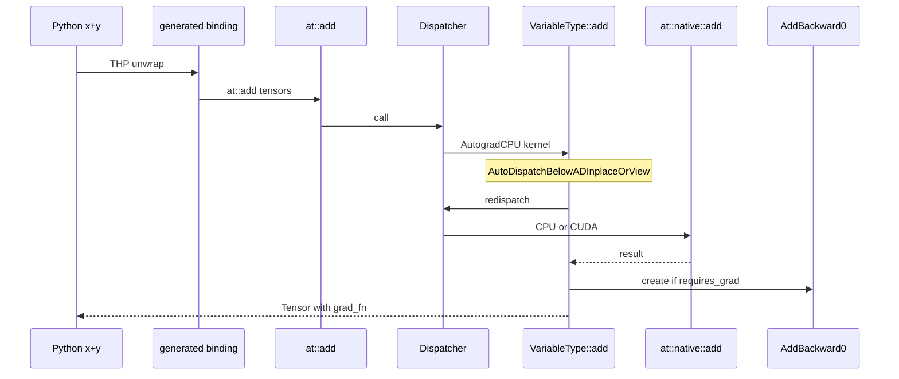
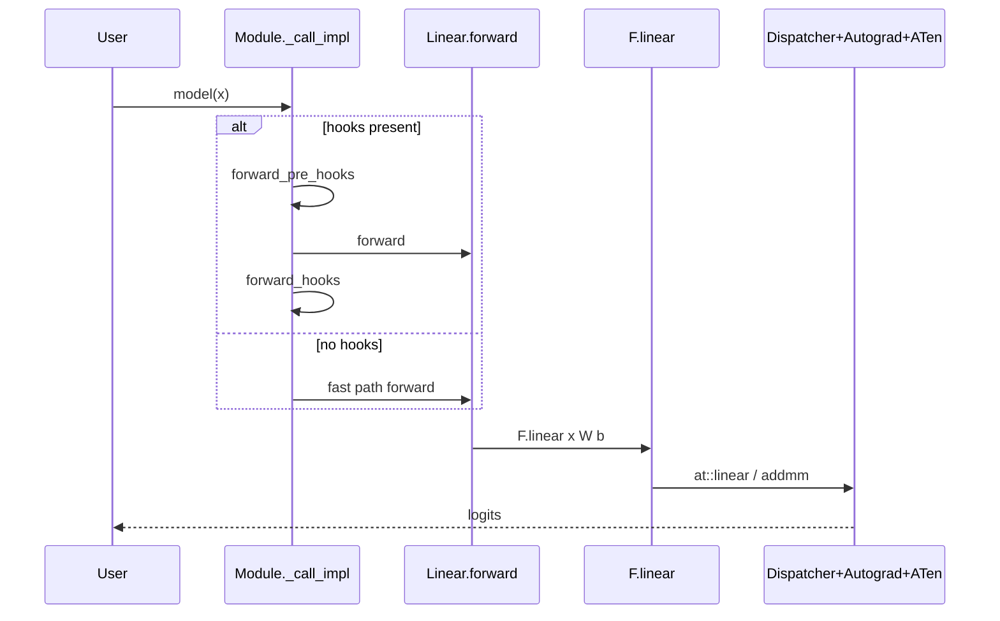
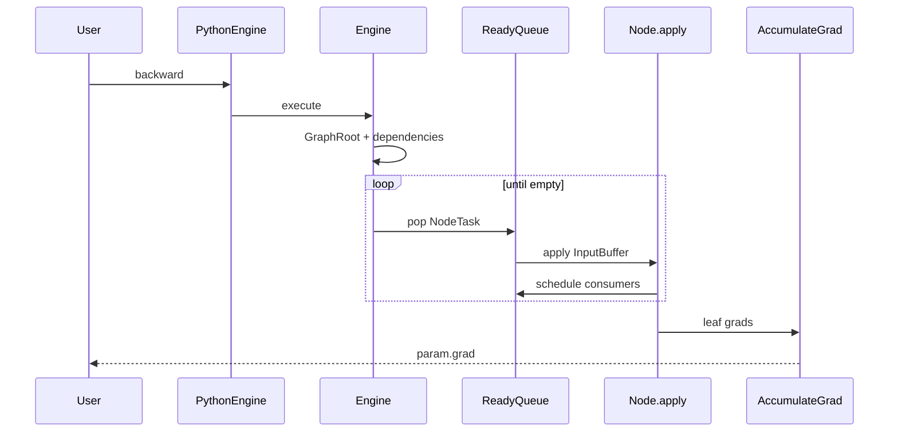
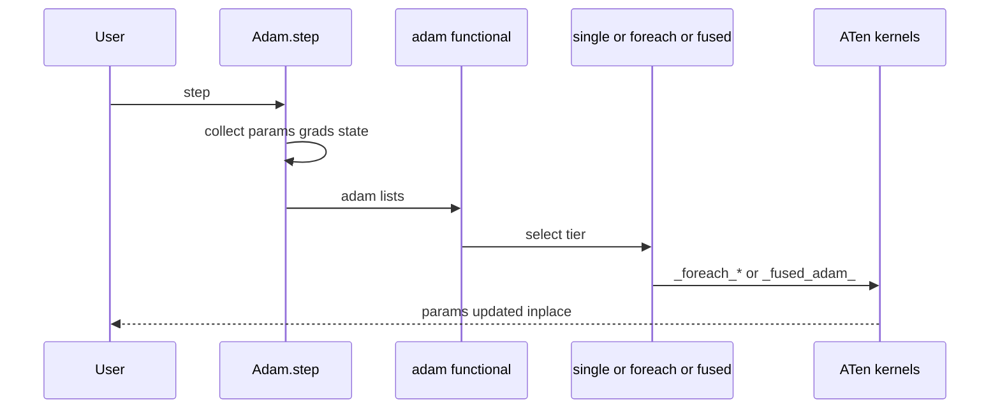
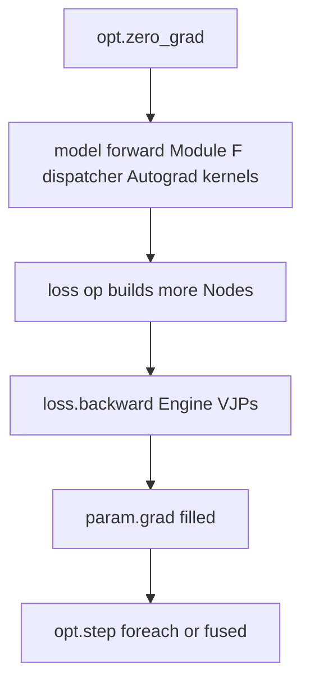

# Diagrams — Call Graphs

Companion to [08-end-to-end-training-step.md](../08-end-to-end-training-step.md)
and [03-dispatcher.md](../03-dispatcher.md).

## Op call: `torch.add` / `x + y`

## Module forward: `Linear`

## Backward: `loss.backward()`

## Optimizer: `Adam.step`

## Full training iteration

## File anchors per hop

| Hop | Primary files |
|-----|----------------|
| Module call | `torch/nn/modules/module.py` |
| Linear | `torch/nn/modules/linear.py` |
| Functional | `torch/nn/functional.py` |
| Bindings | `torch/csrc/autograd/generated/python_*.cpp` (build) |
| Dispatcher | `aten/src/ATen/core/dispatch/Dispatcher.h` |
| Autograd wrap | `tools/autograd/gen_variable_type.py` → generated VariableType |
| Engine | `torch/csrc/autograd/engine.cpp` |
| AccumulateGrad | `torch/csrc/autograd/functions/` |
| Adam | `torch/optim/adam.py` |
| Fused kernel | `aten/src/ATen/native/cuda/FusedAdam*.cu` |

## Related pages

- [05-autograd-engine.md](../05-autograd-engine.md)
- [06-nn-modules.md](../06-nn-modules.md)
- [07-optimizers.md](../07-optimizers.md)
- [08-end-to-end-training-step.md](../08-end-to-end-training-step.md)
