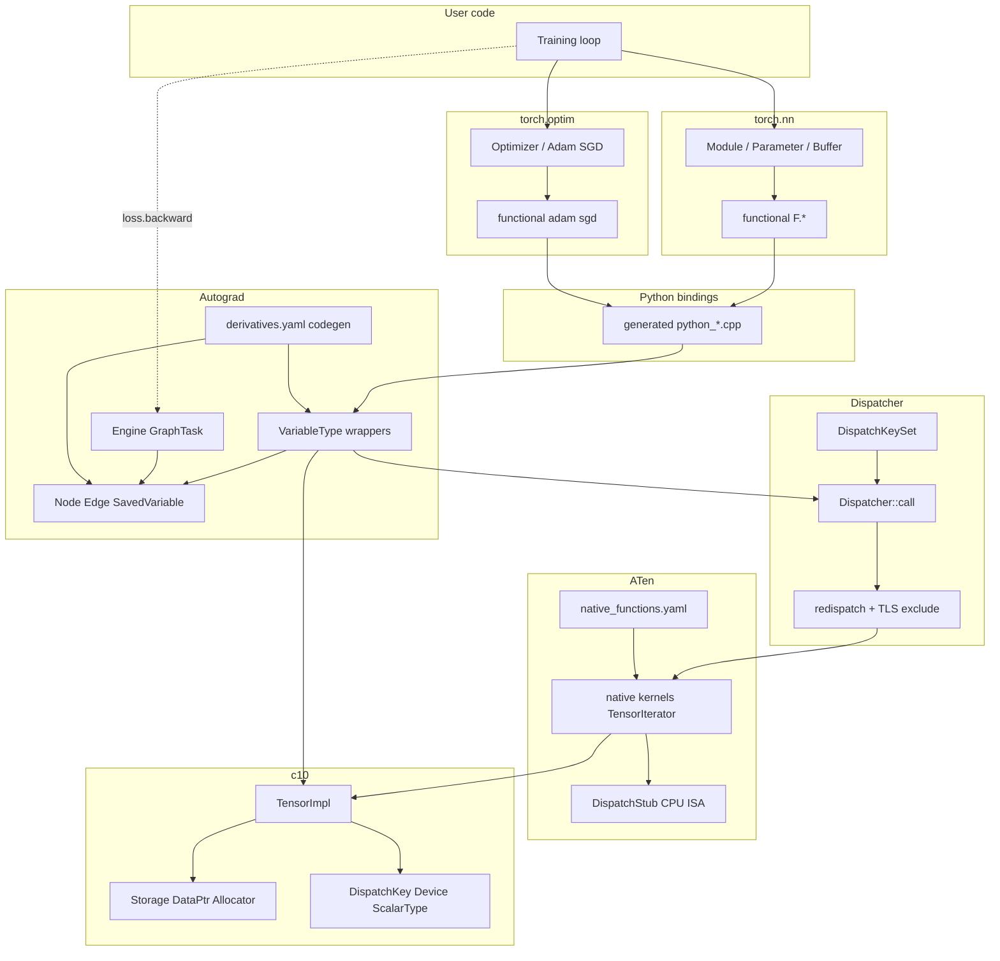
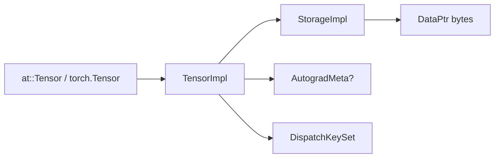

# Diagrams — Dependency Map

Companion to [00-stack-and-mental-model.md](../00-stack-and-mental-model.md).

## Full stack dependencies



## Data ownership only



## Build-time vs run-time

```mermaid
flowchart TB
  subgraph build [Build time]
    nf["native_functions.yaml"]
    dy["derivatives.yaml"]
    tg["torchgen + tools/autograd"]
    gen["generated registrations VariableType Nodes bindings"]
    nf --> tg
    dy --> tg
    tg --> gen
  end
  subgraph run [Run time]
    call["op call"]
    table["OperatorEntry kernel table"]
    kern["native kernel"]
    call --> table --> kern
  end
  gen -->|"links into"| table
```

## Related pages

- [02-c10-tensor-and-storage.md](../02-c10-tensor-and-storage.md)
- [03-dispatcher.md](../03-dispatcher.md)
- [04-aten-and-codegen.md](../04-aten-and-codegen.md)
- [05-autograd-engine.md](../05-autograd-engine.md)
